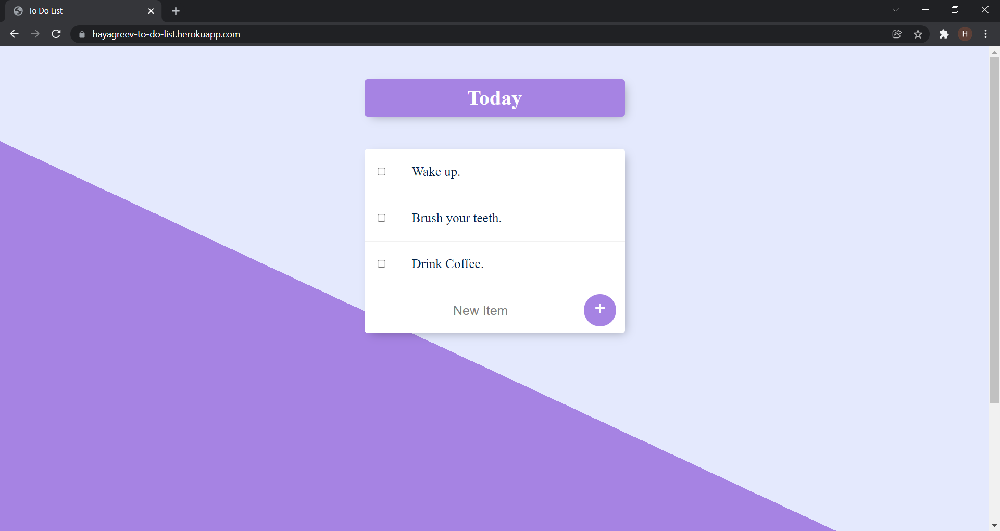

# To-Do-List
This is a To-Do-List application that I've built. The tech stack is NodeJS and Express for the Server, MongoDB Atlas for the Database, HTML and CSS built on EJS Templating for the UI and is hosted on Heroku at https://hayagreev-to-do-list.herokuapp.com.
I have NOT built the HTML and CSS. I just made use of the template that Angela Yu provided as part of her bootcamp's resoruces. I have built the Backend part completely though. I watched her videos completely and tried to build them on my own and if I'm stuck anywhere, I tried to figure it out myself and I'd only go back to the video only if I'm completely stuck and I wasn't able to figure it out at all.

You might notice some lags in the page load. This is because I have set the page to refresh once everytime the page loads to eliminate a bug. The bug was that the CRUD operations were getting updated in the DB but not getting updated on the UI until the page was manually refreshed.

P.S:
As of January 30, 2022, this is a shared database for the lists. Users have not yet been added to separate your lists from others. I'm currently in the process of learning NodeJS fromo Angela Yu's bootcamp so this project was to get my hands dirty on something that had some basic functionality but was not too complicated. I hope to add user based lists in the future. Sorry for any conveniences that this might have caused. 

Functionalities:
This app has a default list with the heading "Today" and also has the capability to render a custom list of your choice. If you want to access a custom list, just type the URL followed by a route of your choice. For example: https://hayagreev-to-do-list.herokuapp.com/home will render a list with a name "Home". I have achieved this using Express route parameters.
The default list will get loaded in the Home route. Both the Custom lists and the default lists have CRD operations enabled. 
Both the lists will get loaded with 3 default items: Wake Up, Brush your teeth and Drink Coffee. One key difference between the both is that when the default list is empty, it will automatically be populated with the default items again but that is not the case with the custom lists. There's no particular reason as to why I did that. I simply felt the need to differenciate between both the types at some level, coz, we've all got our quirks, right?

